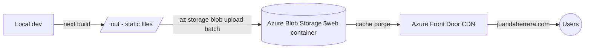

# juandaherrera.com - v6

My personal corner of the internet. A portfolio that showcases who I am, what I've built, and what I know. Rebuilt from scratch with a modern stack and a healthy dose of vibe coding.

> **This is the sixth (and best) iteration of my personal site.** Previous versions go back years, most recently [v5](https://github.com/juandaherrera/personal_web) which was built with Python + [Reflex](https://reflex.dev/). This version is a full rewrite in Next.js - faster, smoother, and vibecoded with the help of [Claude Code](https://claude.ai/code).

---

## ✨ What's inside

The site is organized into the following sections:

| Section | What you'll find |
|---|---|
| **Hero** | A quick intro and typewriter effect cycling through my roles |
| **About** | A bit more about who I am |
| **Tech Stack** | The tools and technologies I work with daily |
| **Experience** | My professional journey, company by company |
| **Projects** | Things I've built and shipped |
| **Education & Certifications** | Degrees, certs, and courses |
| **Footer** | Links, credits, and the vibecode disclosure |

Language switching (ES / EN) is supported across the whole site.

---

## 🛠️ Tech stack

- **[Next.js 16](https://nextjs.org/)** + **[React 19](https://react.dev/)** - app router, server components
- **[TypeScript](https://www.typescriptlang.org/)** - because types are non-negotiable
- **[Tailwind CSS v4](https://tailwindcss.com/)** - utility-first styling
- **[Framer Motion](https://www.framer-motion.com/)** - scroll animations and staggered reveals
- **[react-fast-marquee](https://www.react-fast-marquee.com/)** - the scrolling tech stack strip
- **[Simple Icons](https://simpleicons.org/)** CDN - icon sprites for every tech and tool

---

## 🚀 Running locally

```bash
npm install
npm run dev
```

Open [http://localhost:3000](http://localhost:3000). The page hot-reloads as you edit.

---

## 🔧 Development Workflow

This project uses [Biome](https://biomejs.dev/) as the single tool for linting and formatting.

| Command | What it does |
|---|---|
| `make install` | Install dependencies |
| `make dev` | Start the dev server |
| `make build` | Production build |
| `make lint` | Lint and apply safe auto-fixes |
| `make format` | Format all source files |
| `make check` | Read-only validation - fails on any issue |
| `make ci` | Same as `check`, intended for CI pipelines |
| `make clean` | Remove the `.next` build cache |

**Before committing**, run `make lint` to apply fixes, then `make check` to confirm the output is clean.

**In CI**, only `make ci` runs - it uses `biome check` without `--write`, so it fails if any issue is present.

---

## ☁️ Deployment

The site is deployed as a **static export** (`next export`) to **Azure Blob Storage**, served globally through **Azure Front Door** (CDN + custom domain + HTTPS).



The deploy script (`scripts/deploy.sh`) handles the full flow: build → upload → cache purge.

### Setup

1. Create a `.env` file at the root with the required variables:

```env
STORAGE_ACCOUNT=your_storage_account_name
RESOURCE_GROUP=your_resource_group
FRONTDOOR_PROFILE=your_frontdoor_profile
FRONTDOOR_ENDPOINT=your_frontdoor_endpoint
```

2. Give the script execution permissions (only needed once):

```bash
chmod +x scripts/deploy.sh
```

3. Run the deploy:

```bash
make deploy
```

> Requires the [Azure CLI](https://learn.microsoft.com/en-us/cli/azure/) installed and authenticated (`az login`).

---

## 🤖 Vibecoded

This site was built with the help of [Claude Code](https://claude.ai/code). Most of the implementation, from component architecture to animation tuning, was done through AI-assisted pair programming. It was a fun experiment in what modern vibe coding can produce.

---

## 📝 Commit conventions

Commits follow the format `<emoji> <prefix>: <message>`.

| Prefix | When to use |
|---|---|
| `feat` | New section, component, or visible functionality |
| `fix` | Visual or behavioral bug |
| `style` | Design tweaks - spacing, colors, typography - no logic changes |
| `refactor` | Code restructure without behavior change (e.g. extract component, rename) |
| `content` | Data changes: `content.ts`, copy, images |
| `ci` | GitHub/Azure workflows, deploy config |
| `chore` | Dependencies, config files (`tailwind.config`, `tsconfig`, etc.) |
| `docs` | `README.md`, `CLAUDE.md` |

---

## 📬 Get in touch

- LinkedIn: [linkedin.com/in/juan-david-herrera](https://www.linkedin.com/in/juan-david-herrera/)
- Email: juandaherreparra@gmail.com
